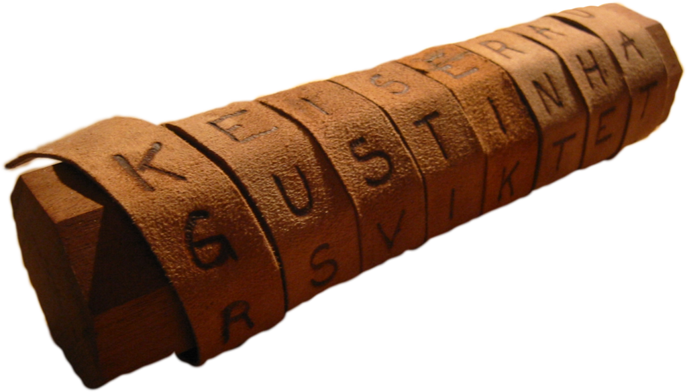

El cifrado escítala es un sistema de criptografía usado por los espartanos eforos y consiste en dos varas del mismo grosor que acordaban el emisor y el receptor. Para enviar el mensaje se enrollaba el papel ( o donde se escribiese el mensaje) en dicha vara y se escribía el mensaje. Una vez escrito, se desenrrollaba el papel y se enviaba al receptor. Al ser escrito sobre un grosor específico, este solo sería lejible si se enrollara sobre otra vara del mismo grosor (cosa que el receptor ha de saber). Adjunto una imagen para que veamos como era:

