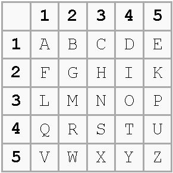

Siendo el cifrado por sustitución mas antiguo que se conoce, el Cifrado de Polybios consta del siglo II a.C.
Este consiste en jugar con la conbinacion de x letras o numeros para hacer referencia a cualquier otra. Este sistema esta pensado para alfabetos de 25 simbolos por lo que para el castellano no funcionaría bien. A continuación vemos un ejemplo de este cifrado:

